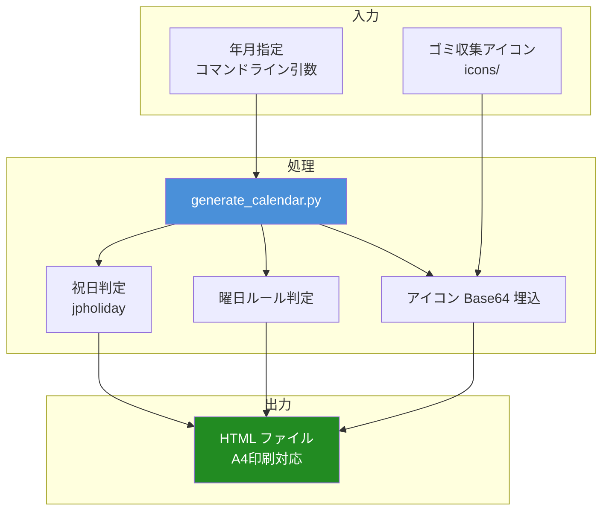
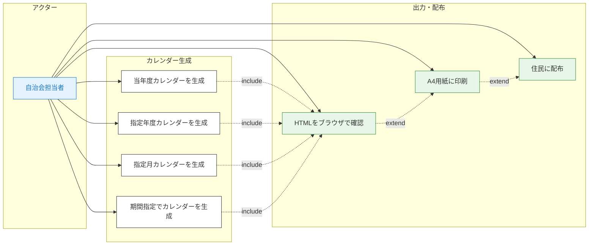

# 秋山自治会ゴミ出しカレンダー自動生成

秋山自治会のゴミ出しカレンダーをHTMLで自動生成するPythonスクリプト

## システム概要

原本PDFのデザインを忠実に再現し、任意の期間のゴミ出しカレンダーをHTML形式で自動生成します。
祝日判定・曜日ごとのゴミ種別を自動配置し、印刷用A4レイアウトに最適化されています。



## ディレクトリ構成

```
akiyama-cal/
├── generate_calendar.py     # メインスクリプト
├── icons/                   # ゴミ収集アイコン画像
│   ├── 01_saisei_kami.png       # 再生する紙
│   ├── 02_recycle_plastic.png   # リサイクルするプラスチック
│   ├── 03_kanen_gomi.png        # 可燃ゴミ
│   ├── 04_gomu_gawa.png         # ゴム・合皮
│   ├── 05_kan_bin.png           # 缶・ビン
│   └── 07_shushu_nashi.png      # 収集なし
├── docs/
│   └── diagrams/
│       └── use-case.mmd         # ユースケース図（Mermaid）
└── README.md
```

## 利用方法

### 前提条件

- Python 3.8 以上
- `jpholiday` ライブラリ

### インストール

```bash
pip install jpholiday
```

### 実行

```bash
# 当年度（4月〜翌3月）を生成
python3 generate_calendar.py

# 指定年度を生成（例: 2026年度 = 2026年4月〜2027年3月）
python3 generate_calendar.py 2026

# 指定年月のみ生成（例: 2026年3月）
python3 generate_calendar.py 2026 3

# 範囲指定（例: 2026年4月〜2028年3月）
python3 generate_calendar.py 2026 4 2028 3
```

### 出力

`gomi_calendar_YYYYMM_YYYYMM.html` が生成されます。
ブラウザで開き、印刷（Ctrl+P）でA4用紙に出力できます。

## ゴミ収集ルール

| 曜日 | ゴミ種別 | 備考 |
|------|----------|------|
| 日 | 再生する紙 | 第5日曜は収集なし |
| 月 | リサイクルするプラスチック | |
| 火 | 可燃ゴミ | |
| 水 | ゴム・合皮・その他のプラスチック | |
| 木 | 可燃ゴミ | |
| 金 | 不燃ゴミ・有害ゴミ・資源ゴミ・剪定枝等 | 奇数週: 紙・布 / 偶数週: ビン・缶 |
| 土 | 可燃ゴミ + 缶・ビン | |

## 技術仕様

- アイコン画像はBase64エンコードしてHTMLに埋め込み（外部ファイル依存なし）
- 祝日判定は `jpholiday` ライブラリを使用
- CSS `@page` による印刷時のA4レイアウト制御
- 月ごとに `page-break-after` で自動改ページ
- 原本PDFのフォントサイズ・色・枠線デザインを忠実に再現

## ユースケース図

[docs/diagrams/use-case.mmd](docs/diagrams/use-case.mmd) を参照してください。


